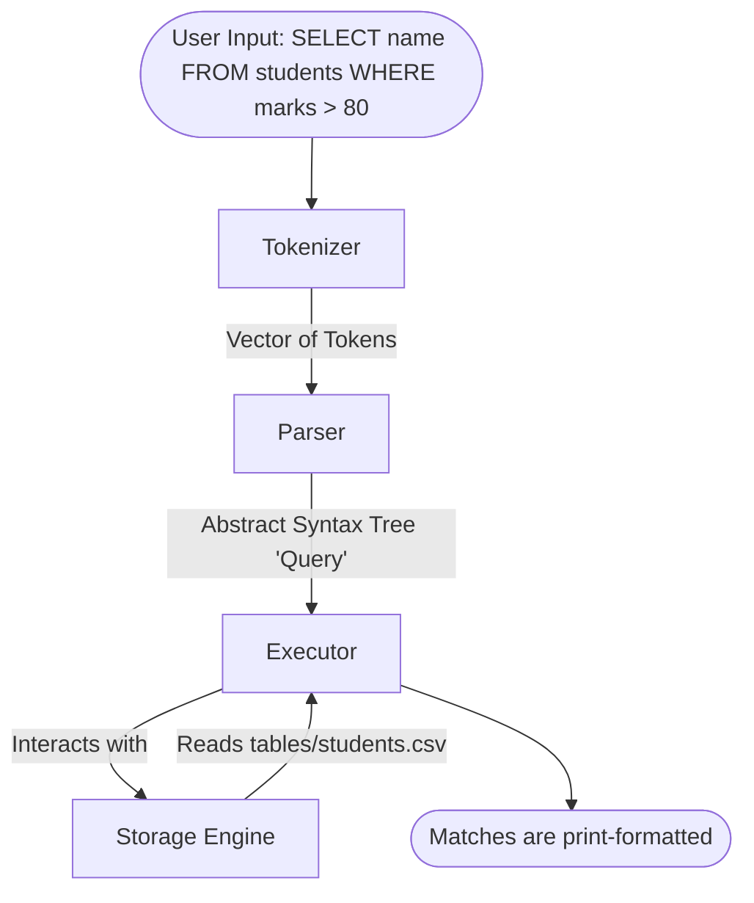

# CoreSQL v1 Implementation Walkthrough

The initial version of **CoreSQL** is complete. We've built an entirely modular, C++ database engine completely from scratch without using any external DB libraries. This fulfills the v1 requirements where queries parse dynamically and tables persist simply on disk as CSVs.

## Directory Structure

We've created a dedicated directory layout focusing on clarity, architecture, and modularity:
```
CoreSQL/
├── CMakeLists.txt
├── src/
│   ├── ast/
│   │   └── query_ast.h (Abstract Syntax Tree Definitions)
│   ├── executor/
│   │   ├── executor.cpp
│   │   └── executor.h  (Processing queries & storage interaction)
│   ├── parser/
│   │   ├── parser.cpp
│   │   └── parser.h    (Grammar rules turning Tokens -> ASTs)
│   ├── storage/
│   │   ├── storage_engine.cpp
│   │   └── storage_engine.h (Appending/reading rows sequentially onto disk files)
│   ├── tokenizer/
│   │   ├── tokenizer.cpp
│   │   └── tokenizer.h (Lexical analysis into Tokens)
│   └── main.cpp        (CoreSQL REPL wrapper)
└── tables/             (Persistent CSV folder)
```

## System Execution Pipeline

Here is a visual map of how a single user input travels linearly across the system. 
This is the CoreSQL system architecture implemented.



### 1. Tokenizer
We implemented a class that loops through your queries, grouping raw text linearly into:
* `Tokens` like: `KEYWORD`, `IDENTIFIER`, `INTEGER`, `STRING`, `OPERATOR`, and `SYMBOL`.
* Whitespace is appropriately skipped while keywords evaluate case-insensitively. 

### 2. Abstract Syntax Tree (AST) & Parser
The `Parser` consumes tokens dynamically resolving to specific C++ structures located in `query_ast.h`:
* `CreateTableQuery` (columns as vectors)
* `InsertQuery` (values as vectors)
* `SelectQuery` (with optional WHERE `Condition` structure attached)

The design completely skips any hardcoded constants by extracting table/column names directly via `Token` values dynamically. 

### 3. Execution Engine & Storage Layer
The `Executor` holds logic routines representing AST branches. Its only linkage out is via `StorageEngine` functions:
* **Storage** creates generic generic headers (`get_table_path()` appends `.csv` implicitly to tables directory).
* **Storage** dynamically serializes C++ Vectors back and forth from disk (comma delimited strings).
* **Executor** supports dynamic types fallback computation: `evaluate_condition` checks whether both operands are strictly numeric and treats them purely computationally, falling back seamlessly onto standard string conditionals (i.e., `<` against string types logic vs numeric types logic).

### Compilation & Next Steps

All necessary logic files are ready. However, we couldn't automatically verify the executable dynamically because MSVC C++ toolkit binaries like `cl`/`cmake`/`g++` aren't globally mapped onto this `PATH` space.

To run it locally in your environment:

1. Open a "Developer Command Prompt for Visual Studio" or Git Bash path that maps C++ tools properly. 
2. Execute standard compiler invocation:
   ```bash
   g++ -std=c++17 -I src src/main.cpp src/tokenizer/tokenizer.cpp src/parser/parser.cpp src/executor/executor.cpp src/storage/storage_engine.cpp -o coresql
   ```
3. Run the CLI Application:
   ```bash
   ./coresql
   ```

You can now start querying via the implemented grammar rules! Let me know what you want to extend in **[Phase 6]** (i.e. complex multi-conditional where clauses, data typing validation, joins, etc).
